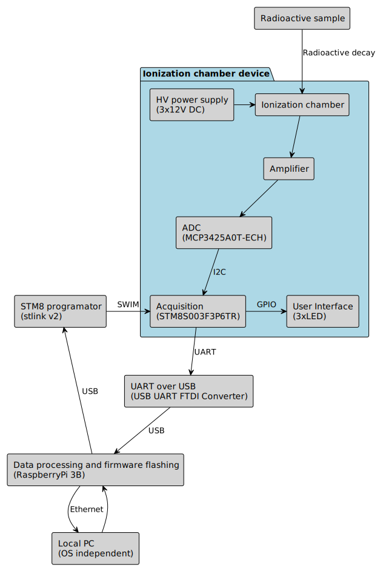

# Ionization Chamber (a device for measuring radioactivity levels)

## Objective

There are many ionization chamber projects online, but most (though not all) produce false positive results. It's cool when a radioactive sample is placed near the detector and the detector shows an increased radiation value, but then, if you place your hand or any non-radioactive object nearby, the readings are high too. This is because, due to high amplification, these devices pick up a lot of noise, making the measurements unreliable.

This project aims to address and eliminate this issue.

## Principle of operation

An ionization chamber is a type of radiation detector that measures ionizing radiation by detecting the charged particles (ions) produced when radiation interacts with the gas inside the chamber. The basic working principle relies on the ionization process. 

* **Radiation Interaction:** When ionizing radiation (such as alpha, beta, or gamma radiation) enters the chamber, it interacts with the gas inside, typically air. This interaction causes the gas molecules to become ionized, producing free electrons and positive ions. 
* **Electric Field:** The chamber contains two electrodes: a central anode and a surrounding cathode. A high voltage is applied between these electrodes, creating an electric field inside the chamber. 
* **Ion Collection:** The free electrons, which are negatively charged, are attracted to the positive anode, while the positively charged ions are attracted to the cathode. As these ions move toward the electrodes, they create an electrical current. 
* **Current Measurement:** The generated current is directly proportional to the number of ions produced, which in turn is related to the amount of radiation that has passed through the chamber. This current is then measured and used to calculate the intensity of the radiation.

Below is an image of the device that was assembled and tested (hardware revision 4.0). Since then, a new version has been developed but has not yet been tested. This repository, in its current state, represents the latest version. For details on the tested version, [refer to 4.0 tag](https://github.com/RobertGawron/IonizationChamber/releases/tag/4.0).  

## System architecture

It is designed in a way that the device can work remotely, e.g. no connection via USB cable to user’s PC is needed.

Remarks:
* The amplifier has three stages (the first stage is a transimpedance amplifier, not a FET transistor like most projects use).
* The ionization chamber is polarized with three 12V batteries connected in series.

## Hardware

PCB was done in KiCAD.

### Hazards

* **The battery container electrodes for chamber polarization are very close to the metal casing; the soldered electrodes should be filed down and secured with insulating tape to prevent short circuits.**
* **The device uses relatively high voltage (32V) to polarize the ionization chamber.** The electrodes of the ionization chamber should not be touched.

## Software

* [Details about the firmware are available here.](./Software/Firmware/README.md)
* [Details about the acquisition software are available here.](./Software/MeasurementAcquisition/README.md)
* [Details about the measurement processing software are available here.](./Software/MeasurementAnalysis/README.md)

In the future, data from the device will be gathered and processed using the [HardwareDataLogger project](https://github.com/RobertGawron/HardwareDataLogger), which is currently in development.

## Simulation

A simple mockup was created to generate dummy test data without the need for the real device. This allows testing of the acquisition software (mainly the scripts that generate output diagrams) without requiring hardware.

[More details.](Simulation/README.md)

## DevOps

All software is developed inside a Docker container.

[More information about setting up the environment.](./DevOps/Docker/README.md)