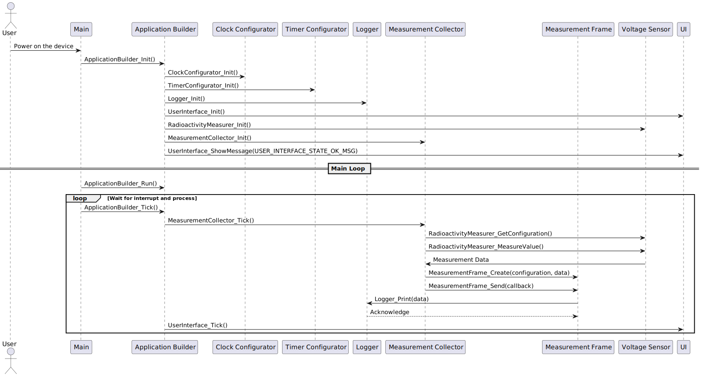

# Architecture

Below is the sequence diagram for the firmware.

# Building Firmware

Docker is used to create an isolated and reproducible work environment.

[Detailed information about setting up the environment.](../../DevOps/Docker/README.md)

# Protocol for sending measurements via UART

## Purpose

To ensure data integrity when sending information from the ionization chamber device to the computer, a simple protocol was added to encapsulate each data or command transmission.

## Protocol details

### Definition of the message

The field “msg length” describes the number of bytes in the “data” section.

The content of the data section in the above message is an example and may vary depending on the message ID. Currently, only one message is supported, as shown above.

### Defined message ids and message content

Currently, only one message type is defined (with ID = 1).

* Msg ID: 1 - Data from the last analog measurement of the actual value.
Msg Data Section:
    * ADC configuration
    * MSB (most significant byte) from ADC
    * LSB (least significant byte) from ADC

### CRC

The CRC is calculated by XOR-ing all bytes in the "preamble" and "data" sections.

