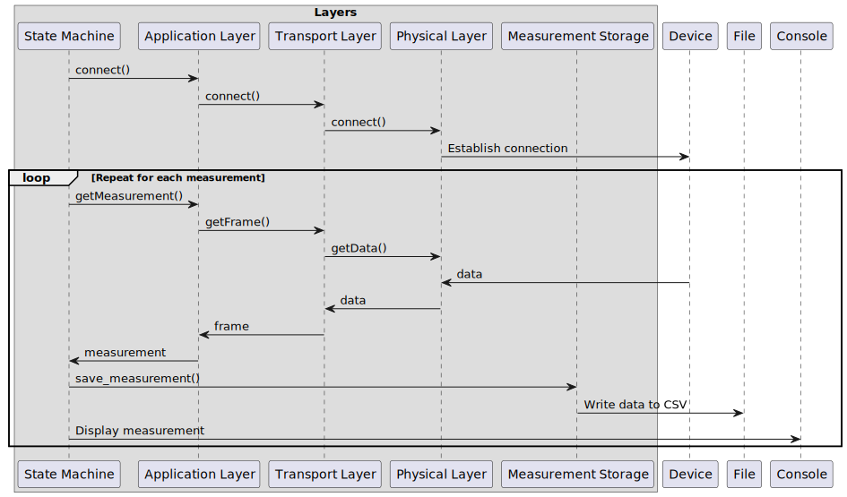

# Simulation

## Purpose

This application gathers data from the device via UART over USB and stores timestamped measurements in a .csv file for further processing.

It was developed to run on a Raspberry Pi but should work on any Linux or Windows system. One note for running it on Windows is that the name of the COM port (configured in myDeviceId) has a different format.

# Usage

[Information on how to use this tool can be found in the "Building, running, and stopping a Docker image" and "Running MeasurementAcquisition scripts" sections.](../DevOps/Docker/README.md)

## Architecture

The diagram below shows the **Sequence Diagram** of this application:

Note that the application can't be stopped normally; use Ctrl+C to terminate it.

The diagram below shows the **State Diagram** of this application:

Note that the "Failure" state is not implemented. We assume that everything works correctly all the time.

