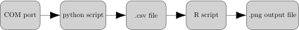
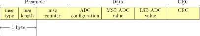

## Architecture

Measurements are collected from COM port (tunneled over USB) by a python script and stored in .cvs file. This file can be later parsed using R scripts to to collect various diagrams (radioactivity changes over time, radioactivity histogram, box-plots for various samples).

## Protocol for sending measurements via UART

## Purpose

To ensure data integrity sent from the ionization chamber device to computer, a simple protocol was added to encapsulate each data/command send.

## Protocol details

The field “msg length” describes amount of bytes the “data” section has.

Definition of the message:

Content of data section in above message is an example and can be different depends on message id, but now only one message is supported and it is as shown above.

### Defined message ids and message content

* Msg id: 1 - data from last analog measurement of actual value.
* Msg data section:
* ADC configuration
* MSB (most significant byte) from ADC
* LSB (least significant byte) from ADC

### CRC
CRC is calculated xor’ing all bytes in "preamble" and "data" section.
